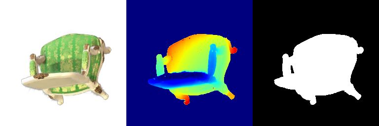
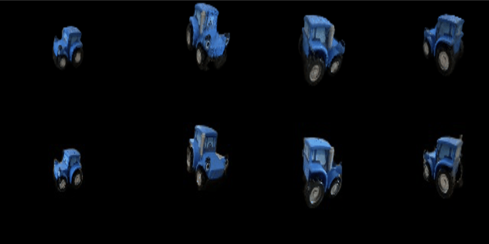
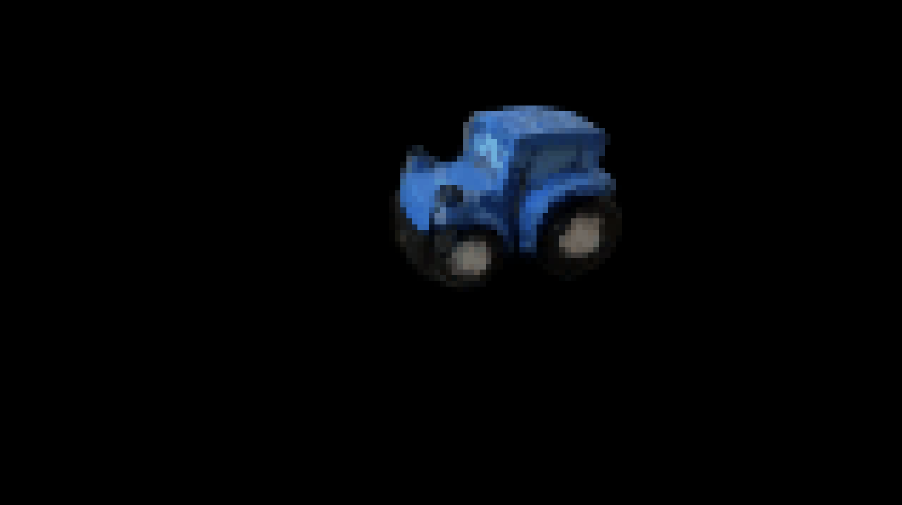
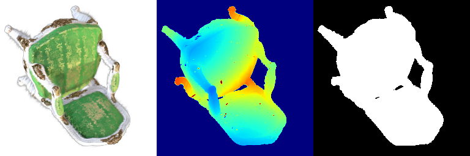
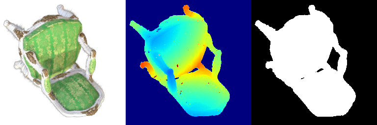
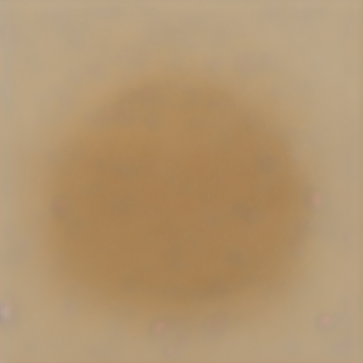
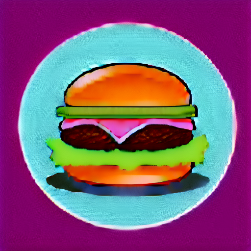
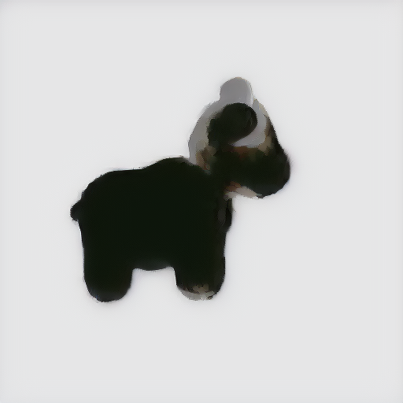
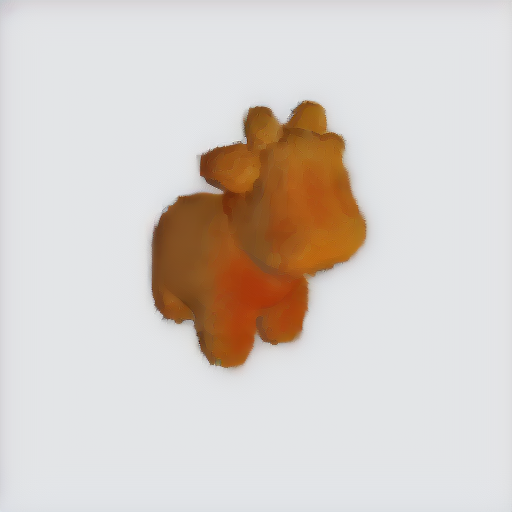
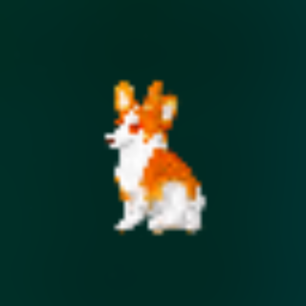

# 16-825 Assignment 4

# 0. Environment Setup

- Please follow the environment setup instructions from the previous assignment. In addition to those packages, you may need: 
  - plyfile
  - scikit-image
  - [diffusers](https://huggingface.co/docs/diffusers/en/installation#install-from-source)
  - [nvdiffrast](https://nvlabs.github.io/nvdiffrast/)
  - [pymeshlab](https://github.com/cnr-isti-vclab/PyMeshLab)
  - [PyMCubes](https://github.com/pmneila/PyMCubes)

- Feel free to install other packages if required.

---

# 1. 3D Gaussian Splatting

In the first part of this assignment, we will explore 3D Gaussian Splatting by building a simplified version of the 3D Gaussian rasterization pipeline introduced by the [original paper](https://repo-sam.inria.fr/fungraph/3d-gaussian-splatting/3d_gaussian_splatting_low.pdf). Once we create the rasterizer, we will first use it to render pre-trained 3D Gaussians provided by the authors of the original paper. Then, we will create training code which leverages the renderer to optimize 3D Gaussians to represent custom scenes.

Notes:

- Please run all code from the `Q1` folder for this section.
- Search for `"### YOUR CODE HERE ###"` for areas where code should be written.
- Please remember to follow the deliverables specified in the **Submission** section in each question.

## 1.1 3D Gaussian Rasterization (35 points)

In this section, we will implement a 3D Gaussian rasterization pipeline in PyTorch. The official implementation uses custom CUDA code and several optimizations to make the rendering very fast. For simplicity, our implementation avoids many of the tricks and optimizations used by the official implementation and hence would be much slower. Additionally, instead of using all the spherical harmonic coefficients to model view dependent effects, we will only use the view independent compoenents.

Inspite of these limitations, once you complete this section successfully, you will find that our simplified 3D Gaussian rasterizer can still produce renderings of pre-trained 3D Gaussians that were trained using the original codebase reaonsably well!

For this section, you will have to complete the code in the files `model.py` and `render.py`. The file `model.py` contains code that manipulates and renders Gaussians. The file `render.py` uses functionality from `model.py` to render a pre-trained 3D Gaussian representation of an object.

In sections `1.1.1` to `1.1.4`, you will have to complete the code in the classes `Gaussians` and `Scene` in the file `model.py`. In section `1.1.5`, you will have to complete the code in the file `render.py`. It might be helpful to first skim both the files before starting the assignment to get a rough idea of the workflow.

> **Note**: All the functions in `model.py` perform operations on a batch of N Gaussians instead of 1 Gaussian at a time. As such, it is recommended to write loopless vectorized code to maximize performance. However, a solution with loops will also be accepted as long as it works and produces the desired output.

### 1.1.1 Project 3D Gaussians to Obtain 2D Gaussians

We will begin our implementation of a 3D Gaussian rasterizer by first creating functionality to project 3D Gaussians in the world space to 2D Gaussians that lie on the image plane of a camera. 

A 3D Gaussian is parameterized by its mean (a 3 dimensional vector) and covariance (a 3x3 matrix). Following equations (5) and (6) of the [original paper](https://repo-sam.inria.fr/fungraph/3d-gaussian-splatting/3d_gaussian_splatting_low.pdf), we can obtain a 2D Gaussian (parameterized by a 2D mean vector and 2x2 covariance matrix) that represents an approximation of the projection of a 3D Gaussian to the image plane of a camera.

For this section, you will need to complete the code in the functions `compute_cov_3D`, `compute_cov_2D` and `compute_means_2D` of the class `Gaussians`. 

### 1.1.2 Evaluate 2D Gaussians

In the previous section, we had implemented code to project 3D Gaussians to obtain 2D Gaussians. Now, we will write code to evaluate the 2D Gaussian at a particular 2D pixel location.

A 2D Gaussian is represented by the following expression:

$$
  f(\mathbf{x}; \boldsymbol{\mu}\_{i}, \boldsymbol{\Sigma}\_{i}) = \frac{1}{2 \pi \sqrt{ | \boldsymbol{\Sigma}\_{i} |}} \exp \left ( {-\frac{1}{2}} (\mathbf{x} - \boldsymbol{\mu}\_{i})^T \boldsymbol{\Sigma}\_{i}^{-1} (\mathbf{x} - \boldsymbol{\mu}\_{i}) \right ) = \frac{1}{2 \pi \sqrt{ | \boldsymbol{\Sigma}\_{i} |}} \exp \left ( P_{(\mathbf{x}, i)} \right )
$$

Here, $\mathbf{x}$ is a 2D vector that represents the pixel location, $\boldsymbol{\mu}$ represents is a 2D vector representing the mean of the $i$-th 2D Gaussian, and $\boldsymbol{\Sigma}$ represents the covariance of the 2D Gaussian. The exponent part $P_{(\mathbf{x}, i)}$ is referred to as **power** in the code.

$$
  P_{(\mathbf{x}, i)} = {-\frac{1}{2}} (\mathbf{x} - \boldsymbol{\mu}\_{i})^T \mathbf{\Sigma}\_{i}^{-1} (\mathbf{x} - \boldsymbol{\mu}\_{i})
$$

The function `evaluate_gaussian_2D` of the class `Gaussians` is used to compute the power. In this section, you will have to complete this function.

**Unit Test**: To check if your implementation is correct so far, we have provided a unit test. Run `python unit_test_gaussians.py` to see if you pass all 4 test cases.

### 1.1.3 Filter and Sort Gaussians

Now that we have implemented functionality to project 3D Gaussians, we can start implementing the rasterizer!

Before starting the rasterization procedure, we should first sort the 3D Gaussians in increasing order by their depth value. We should also discard 3D Gaussians whose depth value is less than 0 (we only want to project 3D Gaussians that lie in front on the image plane).

Complete the functions `compute_depth_values` and `get_idxs_to_filter_and_sort` of the class `Scene` in `model.py`. You can refer to the function `render` in class `Scene` to see how these functions will be used.

### 1.1.4 Compute Alphas and Transmittance

Using these `N` ordered and filtered 2D Gaussians, we can compute their alpha and transmittance values at each pixel location in an image.

The alpha value of a 2D Gaussian $i$ at a single pixel location $\mathbf{x}$ can be calculated using:

$$
  \alpha_{(\mathbf{x}, i)} = o_i \exp(P_{(\mathbf{x}, i)})
$$

Here, $o_i$ is the opacity of each Gaussian, which is a learnable parameter.

Given `N` ordered 2D Gaussians, the transmittance value of a 2D Gaussian $i$ at a single pixel location $\mathbf{x}$ can be calculated using:

$$
  T_{(\mathbf{x}, i)} = \prod_{j \lt i} (1 - \alpha_{(\mathbf{x}, j)})
$$

In this section, you will need to complete the functions `compute_alphas` and `compute_transmittance` of the class `Scene` in `model.py` so that alpha and transmittance values can be computed.

> Note: In practice, when `N` is large and when the image dimensions are large, we may not be able to compute all alphas and transmittance in one shot since the intermediate values may not fit within GPU memory limits. In such a scenario, it might be beneficial to compute the alphas and transmittance in **mini-batches**. In our codebase, we provide the user the option to perform splatting `num_mini_batches` times, where we splat `K` Gaussians at a time (except at the last iteration, where we could possibly splat less than `K` Gaussians). Please refer to the functions `splat` and `render` of class `Scene` in `model.py` to see how splatting and mini-batching is performed.

### 1.1.5 Perform Splatting

Finally, using the computed alpha and transmittance values, we can blend the colour value of each 2D Gaussian to compute the colour at each pixel. The equation for computing the colour of a single pixel is (which is the same as equation (3) from the [original paper](https://repo-sam.inria.fr/fungraph/3d-gaussian-splatting/3d_gaussian_splatting_low.pdf)).

More formally, given `N` ordered 2D Gaussians, we can compute the colour value at a single pixel location $\mathbf{x}$ by:

$$
  C_{\mathbf{x}} = \sum_{i = 1}^{N} c_i \alpha_{(\mathbf{x}, i)} T_{(\mathbf{x}, i)}
$$

Here, $c_i$ is the colour contribution of each Gaussian, which is a learnable parameter. Instead of using the colour contribution of each Gaussian, we can also use other attributes to compute the depth and silhouette mask at each pixel as well!

In this section, you will need to complete the function `splat` of the class `Scene` in `model.py` and return the colour, depth and silhouette (mask) maps. While the equation for colour is given in this section, you will have to think and implement similar equations for computing the depth and silhouette (mask) maps as well. You can refer to the function `render` in the same class to see how the function `splat` will be used.

Once you have finished implementing the functions, you can open the file `render.py` and complete the rendering code in the function `create_renders` (this task is very simple, you just have to call the `render` function of the object of the class `Scene`)

After completing `render.py`, you can test the rendering code by running `python render.py`. This script will take a few minutes to render views of a scene represented by pre-trained 3D Gaussians!

For reference, here is one frame of the GIF that you can expect to see:

<p align="center">
  
</p>

Do note that while the reference we have provided is a still frame, we expect you to submit the GIF that is output by the rendering code.

**GPU Memory Usage**: This task (with default paramter settings) may use approximately 6GB GPU memory. You can decrease/increase GPU memory utilization for performance by using the `--gaussians_per_splat` argument.

> **Submission:** In your webpage, attach the **GIF** that you obtained by running `render.py`

## 1.2 Training 3D Gaussian Representations (15 points)

Now, we will use our 3D Gaussian rasterizer to train a 3D representation of a scene given posed multi-view data. 

More specifically, we will train a 3D representation of a toy truck given multi-view data and a point cloud. The folder `./data/truck` contains images, poses and a point cloud of a toy truck. The point cloud is used to initialize the means of the 3D Gaussians. 

In this section, for ease of implementation and because the scene is simple, we will perform training using **isotropic** Gaussians. Do recall that you had already implemented all the necessary functionality for this in the previous section! In the training code, we just simply set `isotropic` to True while initializing `Gaussians` so that we deal with isotropic Gaussians.

For all questions in this section, you will have to complete the code in `train.py`

### 1.2.1 Setting Up Parameters and Optimizer

First, we must make our 3D Gaussian parameters trainable. You can do this by setting `requires_grad` to True on all necessary parameters in the function `make_trainable` in `train.py` (you will have to implement this function). 

Next, you will have to setup the optimizer. It is recommended to provide different learning rates for each type of parameter (for example, it might be preferable to use a much smaller learning rate for the means as compared to opacities or colours). You can refer to pytorch documentation on how to set different learning rates for different sets of parameters. 

Your task is to complete the function `setup_optimizer` in `train.py` by passing all trainable parameters and setting appropriate learning rates. Feel free to experiment with different settings of learning rates.

### 1.2.2 Perform Forward Pass and Compute Loss

We are almost ready to start training. All that is left is to complete the function `run_training`. Here, you are required to call the relevant function to render the 3D Gaussians to predict an image rendering viewed from a given camera. Also, you are required to implement a loss function that compared the predicted image rendering to the ground truth image. Standard L1 loss should work fine for this question, but you are free to experiment with other loss functions as well.

Finally, we can now start training. You can do so by running `python train.py`. This script would save two GIFs (`q1_training_progress.gif` and `q1_training_final_renders.gif`). 

For reference, here is one frame from the training progress GIF from our reference implementation. The top row displays renderings obtained from Gaussians that are being trained and the bottom row displayes the ground truth. The top row looks good in this reference because this frame is from near the end of the optimization procedure. You can expect the top row to look bad during the start of the optimization procedure.

<p align="center">
  
</p>

Also, for reference, here is one frame from the final rendering GIF created after training is complete

<p align="center">
  
</p>

Do note that while the reference we have provided is a still frame, we expect you to submit the GIFs output by the rendering code. 

Feel free to experiment with different learning rate values and number of iterations. After training is completed, the script will save the trained gaussians and compute the PSNR and SSIM on some held out views. 

**GPU Memory Usage**: This task (with default paramter settings) may use approximately 15.5GB GPU memory. You can decrease/increase GPU memory utilization for performance by using the `--gaussians_per_splat` argument.

> **Submission:** In your webpage, include the following details:
> - Learning rates that you used for each parameter. If you had experimented with multiple sets of learning rates, just mention the set that obtains the best performance in the next question.
> - Number of iterations that you trained the model for.
> - The PSNR and SSIM.
> - Both the GIFs output by `train.py`.

## 1.3 Extensions **(Choose at least one! More than one is extra credit)**

### 1.3.1 Rendering Using Spherical Harmonics (10 Points)

In the previous sections, we implemented a 3D Gaussian rasterizer that is view independent. However, scenes often contain elements whose apperance looks different when viewed from a different direction (for example, reflections on a shiny surface). To model these view dependent effects, the authors of the 3D Gaussian Splatting paper use spherical harmonics.

The 3D Gaussians trained using the original codebase often come with learnt spherical harmonics components as well. Infact, for the scene used in section 1.1, we do have access to the spherical harmonic components! For simplicity, we had extracted only the view independent part of the spherical harmonics (the 0th order coefficients) and returned that as colour. As a result, the renderings we obtained in the previous section can only represent view independent information, and might also have lesser visual quality.

In this section, we will explore rendering 3D Gaussians with associated spherical harmonic components. We will add support for spherical harmonics such that we can run inference on 3D Gaussians that are already pre-trained using the original repository (we will **not** focus on training spherical harmonic coefficients).

In this section, you will complete code in `model.py` and `data_utils.py` to enable the utilization of spherical harmonics. You will also have to modify parts of `model.py`. Please lookout for the tag `[Q 1.3.1]` in the code to find parts of the code that need to be modified and/or completed.

In particular, the function `colours_from_spherical_harmonics` requires you to compute colour given spherical harmonic components and directions. You can refer to function `get_color` in this [implementation](https://github.com/thomasantony/splat/blob/0d856a6accd60099dd9518a51b77a7bc9fd9ff6b/notes/00_Gaussian_Projection.ipynb) and create a vectorized version of the same for your implementation.

Once you have completed the above tasks, run `render.py` (use the same command that you used for question 1.1.5). This script will take a few minutes to render views of a scene represented by pre-trained 3D Gaussians.

For reference, here is one frame of the rendering obtained when we use all spherical harmonic components:

<p align="center">
  
</p>

For comparison, here is one frame of the rendering obtained when we used only the DC spherical harmonic component (i.e., what we had done for question 1.1.5):

<p align="center">
  
</p>

> **Submission:** In your webpage, include the following details:
> - Attach the GIF you obtained using `render.py` for questions 1.3.1 (this question) and 1.1.5 (older question).
> - Attach 2 or 3 side by side RGB image comparisons of the renderings obtained from both the cases. The images that are being compared should correspond to the same view/frame.
> - For each of the side by side comparisons that are attached, provide some explanation of differences (if any) that you notice.

### 1.3.2 Training On a Harder Scene (10 Points)

In section 1.2, we explored training 3D Gaussians to represent a scene. However, that scene is relatively simple. Furthermore, the Gaussians benefitted from being initialized using many high-quality noise free points (which we had already setup for you). Hence, we were able to get reasonably good performance by just using isotropic Gaussians and by adjusting the learning rate.

However, real scenes are much more complex. For instance, the scene may comprise of thin structures that might be hard to model using isotropic Gaussians. Furthermore, the points that are used to initialize the means of the 3D Gaussians might be noisy (since the points themselves might be estimated using algorithms that might produce noisy/incorrect predictions).

In this section, we will try training 3D Gaussians on harder data and initialization conditions. For this task, we will start with randomly initialized points for the 3D Gaussian means (which makes convergence hard). Also, we will use a scene that is more challenging than the toy truck data that you used for question 1.2. We will use the materials dataset from the NeRF synthetic dataset. While this dataset does not have thin structures, it has many objects in one scene. This makes convergence challenging due to the type of random intialization we do internally (we sample points from a single sphere centered at the origin). You can download the materials dataset from [here](https://drive.google.com/file/d/1v_0w1bx6m-SMZdqu3IFO71FEsu-VJJyb/view?usp=sharing). Unzip the materials dataset into the `./Q1/data` directory.

You will have to complete the code in `train_harder_scene.py` for this question. You can start this question by reusing your solutions from question 1.2. But you may quickly realize that this may not give good results. Your task is to experiment with techniques to improve performance as much as possible.

Here are a few possible ideas to try and improve performance:
- You can start by experimenting with different learning rates and training for much longer duration.
- You can consider using learning rate scheduling strategies (and these can be different for each parameter).
- The original paper uses SSIM loss as well to encourage performance. You can consider using similar loss functions as well.
- The original paper uses adaptive density control to add or reduce Gaussians based on some conditions. You can experiment with a simplified variant of such schemes to improve performance.
- You can experiment with the initialization parameters in the `Gaussians` class.
- You can experiment with using anisotropic Gaussians instead of isotropic Gaussians. 

> **Submission:** In your webpage, include the following details:
> - Follow the submission instructions for question 1.2.2 for this question as well.
> - As a baseline, use the training setup that you used for question 1.2.2 (isotropic Gaussians, learning rates, loss etc.) for this dataset (make sure `Gaussians` have `init_type="random"`). Save the training progress GIF and PSNR, SSIM metrics.
> - Compare the training progress GIFs and PSNR, SSIM metrics for both the baseline and your improved approach on this new dataset.
> - For your best performing method, explain all the modifications that you made to your approach compared to question 1.2 to improve performance.

---

# 2. Diffusion-guided Optimization
In this question, you will implement Score Distillation Sampling (SDS) loss and apply it to different applications, i.e. image optimization (Q2.1), mesh texture optimization (Q2.2), and nerf optimization (Q2.3).

**Note**:
* All the reference timing is based on a A5000, 24G memory GPU, using default parameters.
* Search for "### YOUR CODE HERE ###" to check the code sections to implement.
* We provide basic logging and visualization code. You are welcome to modify them as you like, but remember to follow the deliverables specified in *Submission* section in each question.


## 2.1 SDS Loss + Image Optimization (20 points)
First, you will implement the SDS loss. We provide a skeleton code in `SDS.py` and you will fill up the `sds_loss` function. Hint: follow the [DreamFusion](https://arxiv.org/pdf/2209.14988.pdf) paper (Fig. 3) and the step-by-step guide in the comments. We provide `prepare_embeddings` in `utils.py` that compute the text embedding given text prompts. Take a look at what it is returning and then implement the followings:

*  Implement SDS without guidance, i.e. with positive prompts only (`text_embeddings_uncond is None`). (10 pts)
Essentially, SDS measures how a rendered view image matches a given text prompt, using a pre-trained diffusion model.

* Implement SDS with guidance, i.e. with both positive and negative prompts (`text_embeddings_uncond is not None`). (10 pts)
[Prior work](https://arxiv.org/pdf/2207.12598.pdf) has shown that classifier-free guidance significantly improves sampling fidelity and generative results. Basically, it mixes the score estimates of a conditional diffusion model and a jointly trained unconditional diffusion model. In our case, you will mix the predicted noise obtained from conditional prompt (positive prompt) and that obtained from an unconditional prompt (empty string as the negative prompt), and use the new predicted noise to compute the gradient.

Note that the default negative prompt is an empty string `""`, but you can still get its embedding and feed it to `sds_loss` as `text_embeddings_uncond`.

After implementing the loss, verify your implementation using image optimization. In `Q21_image_optimization.py`, implement the loss computation in the forward pass of the training loop. Use the `--prompt` argument to play with different prompt input and use `--sds_guidance` argument to toggle on and off the guidance setting for loss computation.

(Estimated time for image optimization per prompt: 80s for "sds_guidance=0" and 165s for "sds_guidance=1". About 12G memory is needed.)

**Note**: Q2.1 is for you to explore the implementation of SDS loss. After the full implementation, you should always use SDS loss with guidance, i.e. `sds_guidance=1` for the following questions.

The following shows reference output that you would expect for sds loss without and with guidance. Note that the best result may not happen at the final iteration; thus save some intermediate results, e.g. per 100 iterations, to track and debug the training process. Also, feel free to use `--postfix` argument to modify the output directory so that results of multiple runs don't overwrite each other.
<p align="center">
  
  &nbsp; &nbsp; &nbsp; &nbsp; <!-- This is for adding space between the images -->
  
</p>
<p align="center">
  <em>Without guidance (400 iterations)</em>
  &nbsp; &nbsp; &nbsp; &nbsp; &nbsp; &nbsp; &nbsp; &nbsp; &nbsp; &nbsp; &nbsp; &nbsp; &nbsp; &nbsp; &nbsp; &nbsp; &nbsp; &nbsp; &nbsp;
  <em>With guidance (1000 iterations)</em>
</p>

> <g>**Submission**</g>: On your webpage, show image output for four different prompts. Use the following two example prompts and two more of your own choice.
* "a hamburger"
* "a standing corgi dog" 

For each case (with and without guidance), show the "prompt - image" pair and indicate how many iterations you trained to obtain the results.


## 2.2 Texture Map Optimization for Mesh (15 points)
In this section, you are going to optimize the texture map of a mesh with fixed geometry using SDS loss.

We provide a cow mesh in the `data` folder. You will load it and re-texture it given different text prompts.

In `Q22_nerf_optimization.py`, we provide a skeleton code. The texture map is represented by a ColorField, similar to the NeRF architecture you have learned before. It takes in the 3D coordinate of vertices (1, N_v, 3) and output per vertex color (1, N_v, 3). The mesh will then take the output of the ColorField as its texture map.
```
color_field = ColorField().to(device)  # input (1, N_v, xyz) -> output (1, N_v, rgb)
mesh = pytorch3d.structures.Meshes(
    verts=vertices,
    faces=faces,
    textures=TexturesVertex(verts_features=color_field(vertices)),
)
mesh = mesh.to(device)
```

Since we want to optimize the rendered views using SDS loss, you will create a training set of query cameras. You can either pre-define a list of query cameras
```
query_cameras = 
```
or randomly sample a camera pose on the fly in the training loop.

In each iteration, you will create a randomly sampled camera (and optionally a randomly sampled light condition), render the camera view, and compute SDS loss on the rendered image.

(Estimated time for mesh optimization per prompt: 13min. About 13G memory is needed.)

The following shows sampled views for texture maps of different colors. (You should submit gifs with corresponding text prompts instead of static images.)
<p align="center">
  
  &nbsp; &nbsp; &nbsp; &nbsp; <!-- This is for adding space between the images -->
  
</p>

> <g>**Submission**</g>: On your webpage, show the gif of the final textured mesh given two different text prompts. You should be able to vary the color and texture pattern using diffent text prompts.


## 2.3 NeRF Optimization (15 points)
In Q2.2, the geometry of the mesh is fixed and we only optimize the color texture. Now we are generalizing the 3D representation from a mesh to a NeRF model, where both the geometry and the color are learnable.

In `Q23_nerf_optimization.py`, we provide a skeleton code, where the dataset and the NeRF model are pre-defined. Similar to previous questions, you will implement the forward pass in the training loop, i.e. encode the predicted RGB images into `latents` and compute the SDS loss.

In the original paper of [DreamFusion](https://arxiv.org/pdf/2209.14988.pdf), the authors propose several tricks that make SDS loss work better for NeRF optimization. We are going to explore a few of them. 

* One of the tricks is additional regularization terms in the loss function. (Sec. 3.1 and A.2 in the original paper). The regularization terms are already implemented for you; however, they are disabled (weight=0) by default. Tune the loss weight hyperparameters `lambda_entropy` and `lambda_orient` so that you get reasonable results for NeRF optimization. (*Hint*: try something small such as 1e-3, 1e-2, 1e-1, etc.)

* Another trick that significantly improves the geometry of NeRF model is that instead of directly modeling the RGB color appearance, the neural field models the albedo and renders the lambertian surface given the lighting condition and surface normal. In the training loop, implementation of different shading methods is provided. You will need to tune the parameter `latent_iter_ratio` so that the model uses `normal` shading at the beginning as a warmup then switches to "random" shading between `textureless` and `lambertian`. The default value is set to be `latent_iter_ratio=0` (*Hint*: try something in range [0, 1] such as 0.1, 0.2, 0.5 etc.)

You will need to tune the above-mentioned parameters to obtain good NeRF optimization results.

(Estimated time for mesh optimization per prompt: 90 min. About 14G memory is needed.)

The following shows a sampled view of the optimized NeRF. 
<p align="center">
  
</p>

> <g>**Submission**</g>: On your webpage, show the video (.mp4 or .gif) of rendered rgb and depth images for three example prompts, one being "a standing corgi dog" and the other two of your own choice. The rendered object should match the prompt with reasonable geometry and color appearance, i.e. it may not be super photorealistic, but should at least be clear and recognizable object.

## 2.4 Extensions (Choose at least one! More than one is extra credit)
### 2.4.1 View-dependent text embedding (10 points)
In Q2.3, you may notice that the NeRF results may not be 3D consistent, e.g. multiple front faces across different views. That is because SDS optimizes each rendered view independently and does not consider the viewing angle. The DreamFusion proposes a way to use view-dependent text embedding to obtain better 3D consistent results (-> Sec. 3.2. 3. Diffusion loss with view-dependent conditioning).
The view-dependent conditioning is provided in `utils.py` -> `prepare_embeddings()`. You need to toggle `view_dependent` option to `True` and figure out how to use it in the training loop of `Q23_nerf_optimization.py`.

> <g>**Submission**</g>: On your webpage, show the video of rendered rgb and depth images for at leat two example prompts, one being "a standing corgi dog" and the other one of your own choice. Compare the visual results with what you obtain in Q2.3 and qualitatively analyse the effects of view-dependent text conditioning.

### 2.4.2 Other 3D representation (10 points)
You have seen and tried how to use SDS loss to optimize a 3D representation (mesh and NeRF). In this question, you will explore other 3D representations of your choice, e.g. voxel, NeRF with SDF, gaussian, etc. Choose a representation, try to render it from different camera views, and use SDS loss (with suitable regularizations) to optimize the rendered images, which should update the 3D representation to match the given text prompt. 

> <g>**Submission**</g>: On your webpage, describe which representation you choose, how you render a sampled view, and any other loss/regularaization you have used. Show visual results for at least one text prompt of your choice. Compare the results with NeRF and briefly explain why it works bettter or worse. 

### 2.4.3 Variation of implementation of SDS loss (10 points)
Current SDS loss is implemented in the latent space, i.e. given an RGB image, we first encode it into latent space and then sample the noise. In this question, you can try to implement it in the pixel space, i.e. directly get pixel-space gradients via reconstruction error in pixel space. Since the loss is in pixel space, you can also different variations, e.g. instead of L2 loss, you can use LPIPS loss to compute the gradients. 

> <g>**Submission**</g>: On your webpage, describe how you implement the SDS loss in pixel space and how you compute the gradients. Compare the visual results of NeRF optimization for at least one text prompt. Briefly analyze the results (image quality, training time, etc.) and explain why it works better or worse.  
